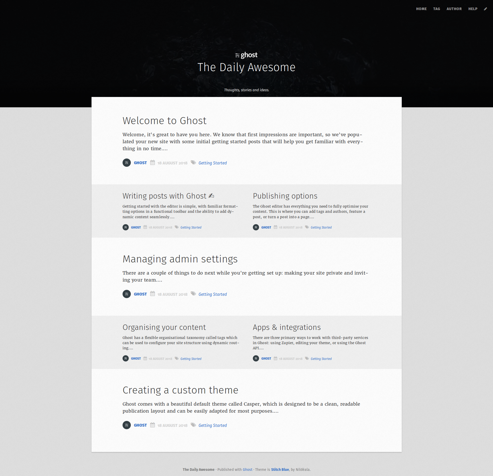
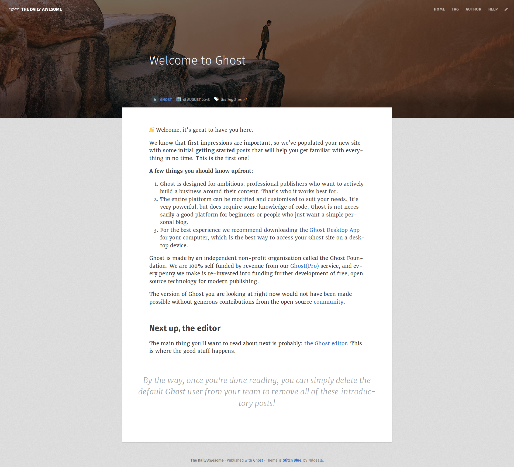
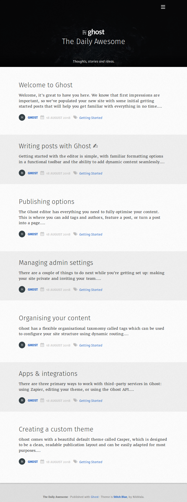
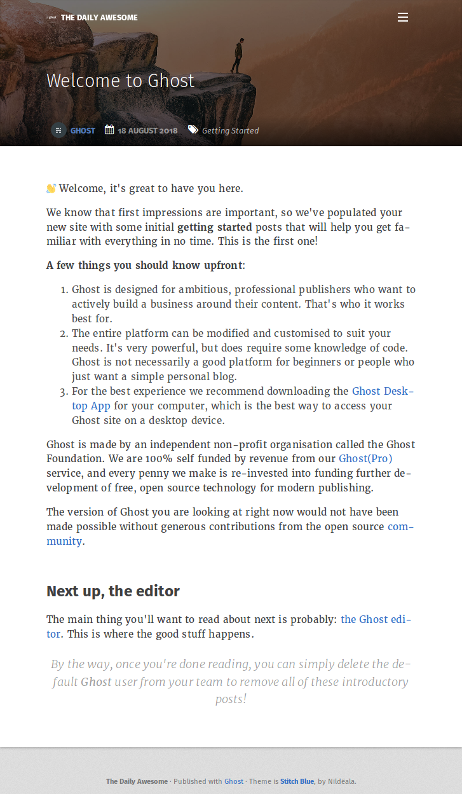

# Stitch Blue *for Ghost*
A nice and elegant theme for Ghost, inspired by the color Stitch blue.

*README is waiting to be redone*

## Some screenshots

* Homepage on desktop

* Some article on desktop

* Homepage on mobile

* Some article on mobile

## Search engine

This theme includes the [ghostHunter](https://github.com/jamalneufeld/ghostHunter) search engine on a dedicated page we handle with the [custom template](https://themes.ghost.org/docs/page-context) `page-search.hbs`. You either need to create a [static page](https://help.ghost.org/hc/en-us/articles/224936867-Static-Pages) with the `search` slug or to move the file to a matching `page-:slug.hbs`.
